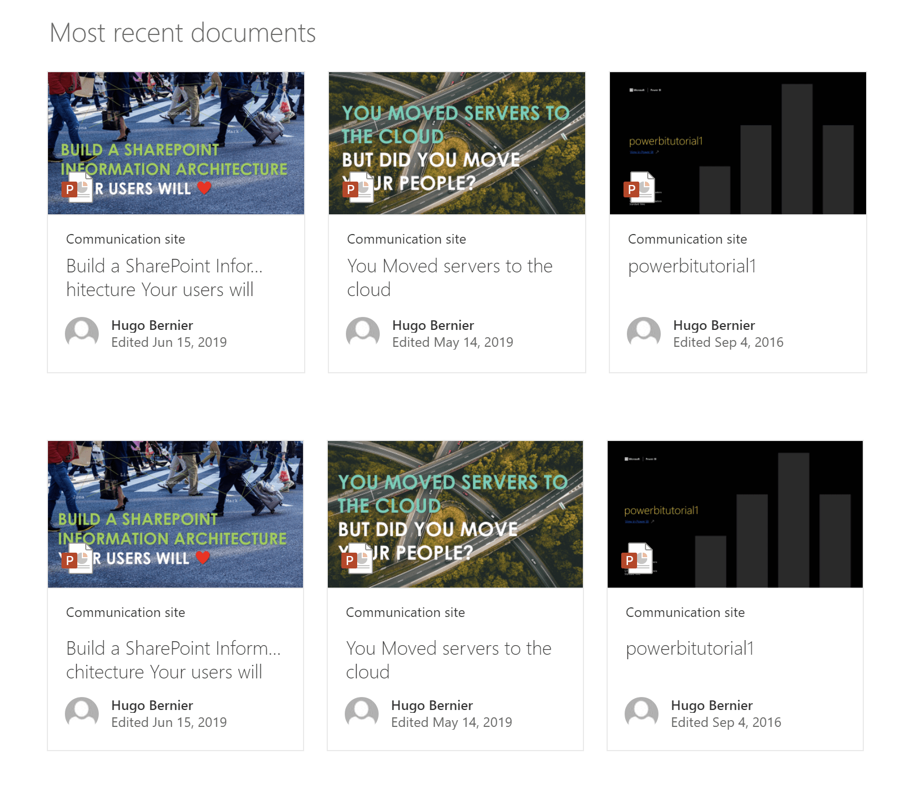

# WebPartLayouts

## Summary

Shows how to use the various web part layouts.

### Grid Control

## Used SharePoint Framework Version

## Applies to

* [SharePoint Framework](https:/dev.office.com/sharepoint)
* [Office 365 tenant](https://dev.office.com/sharepoint/docs/spfx/set-up-your-development-environment)

## Prerequisites

There are no pre-requisites

## Solution

Solution|Author(s)
--------|---------
WebPartLayouts | Hugo Bernier ([Tahoe Ninjas](http://tahoeninjas.blog), [@bernierh](https://www.twitter.com/bernierh))

## Version history

Version|Date|Comments
-------|----|--------
1.0|July 28, 2019|Initial release

## Disclaimer

**THIS CODE IS PROVIDED *AS IS* WITHOUT WARRANTY OF ANY KIND, EITHER EXPRESS OR IMPLIED, INCLUDING ANY IMPLIED WARRANTIES OF FITNESS FOR A PARTICULAR PURPOSE, MERCHANTABILITY, OR NON-INFRINGEMENT.**

---

## Minimal Path to Awesome

* Clone this repository
* in the command line run:
  * `npm install`
  * `gulp serve`

## Features

This solution contains the following features:

* Grid Layout control
